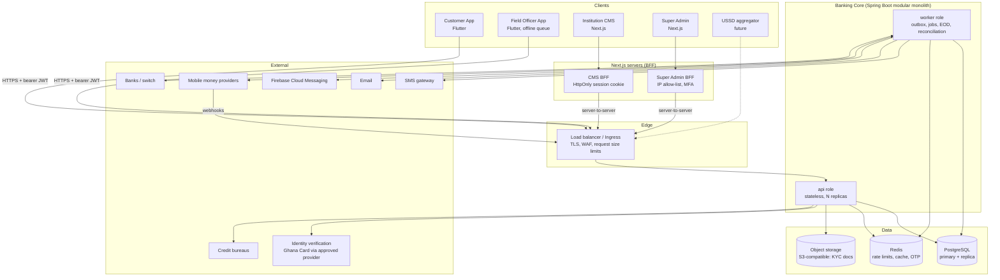
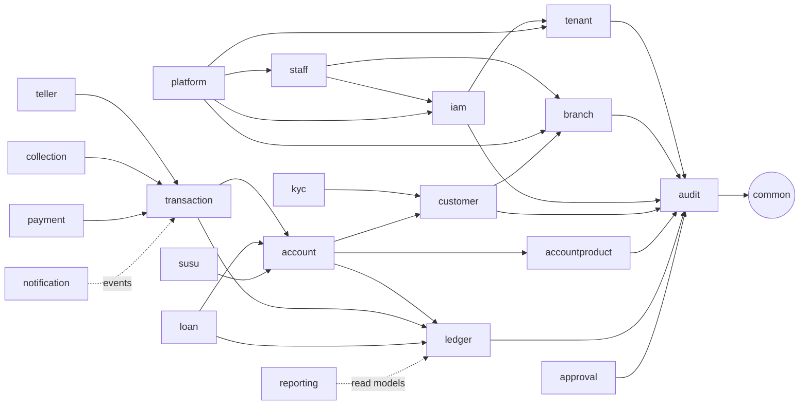
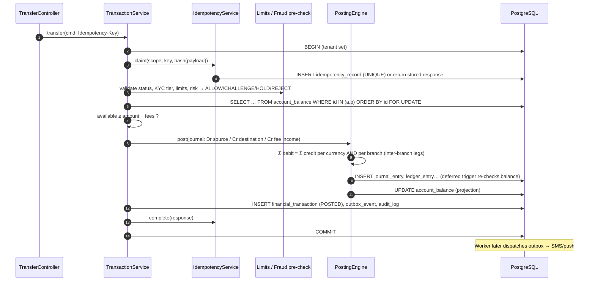
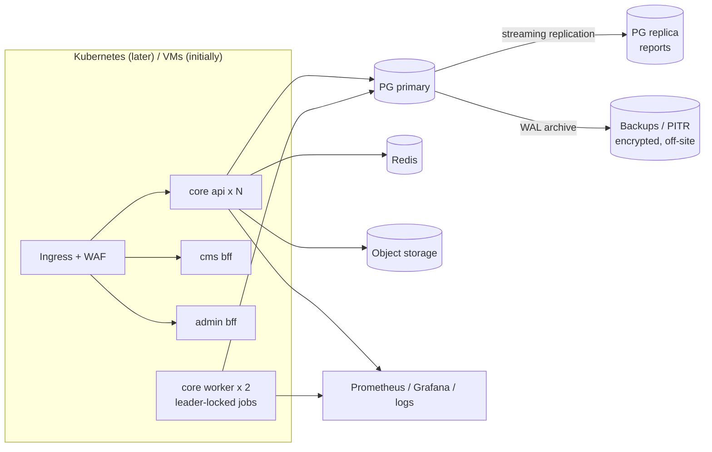

# 01 — System Architecture

Status: **Accepted baseline** · Read after: [00-specification-review.md](00-specification-review.md)

## 1. System context



**Principles**

1. **One source of financial truth.** The double-entry ledger in PostgreSQL. Everything else (balances, dashboards, reports, search indexes) is a projection that must reconcile to it.
2. **All business rules live in the Java core.** Flutter and Next.js are presentation layers. Next.js runs server-side code only as a **BFF** (session cookies, token forwarding, response shaping), never business logic and never database access.
3. **One deployable, two runtime roles.** The same jar runs as `api` (HTTP, scaled horizontally) or `worker` (outbox dispatch, scheduled jobs, EOD, reconciliation). Long batch work never competes with request threads, and nothing has to be split into services.
4. **Fail closed.** No tenant context means no rows (RLS). No permission means 403. Unknown external payment outcome means funds stay held.

## 2. Backend architecture

### 2.1 Module map

Top-level packages under `com.company.banking`. Arrows are *allowed* compile-time dependencies. Anything not drawn is forbidden and checked by ArchUnit.



| Module | Responsibility | Phase |
|---|---|---|
| `common` | Shared kernel: API envelope, error model, `Money`, IDs (UUIDv7), clock, tenant context, pagination, base entities. **No business logic.** | 1 |
| `audit` | Immutable audit trail; query API. | 1 |
| `tenant` | Tenant registry, institution profile and branding, feature flags/licences, settings. | 1 |
| `branch` | Branches and branch status. | 1 |
| `iam` | Staff and platform credentials, roles, permissions, sessions, refresh tokens, login/lockout, JWT, Spring Security config. | 1 |
| `staff` | Staff profile, home branch, branch access scope; implements `iam`'s `StaffDirectory` SPI. | 1 |
| `platform` | Super-admin use cases: tenant onboarding, licensing, platform users. | 1 |
| `customer`, `kyc` | Customer master data (individual / business / group), KYC cases, documents, identity-verification port. | 1B |
| `accountproduct`, `account` | Versioned deposit products; deposit accounts, holds, limits, balances projection. | 2 |
| `ledger` | Chart of accounts, ledger accounts, journals, **Posting Engine**, accounting periods. | 2 |
| `transaction` | Money-movement orchestration, idempotency, reversals. | 2 |
| `charge` | Fees, levies, taxes. | 2 |
| `approval` | Generic maker-checker with thresholds. | 2 |
| `teller`, `cash`, `businessdate`, `eod`, `reconciliation` | Branch operations. | 3 |
| `susu`, `collection`, `fieldops` | Microfinance field operations, offline sync. | 4 |
| `loan` (+ `repayment`, `guarantor`, `collateral` sub-packages) | Lending. | 5 |
| `channel` | Customer-channel auth (PIN, devices, OTP), beneficiaries. | 6 |
| `payment`, `integration` | Provider adapters, webhooks, settlement. | 7 |
| `fraud`, `compliance` | Rules engine, alerts, cases. | 8 |
| `reporting` | Read models and exports. | 9 |

### 2.2 Inside a module

```text
<module>/
├── controller/   REST endpoints (thin: validate → call service → map)
├── service/      PUBLIC API of the module + use-case orchestration, @Transactional boundaries
├── repository/   Spring Data repositories (module-private)
├── entity/       JPA entities (module-private; never serialized)
├── dto/          request/response records (Jakarta Validation)
├── mapper/       MapStruct mappers entity ↔ DTO
├── validator/    business validation not expressible as annotations
├── exception/    module-specific exceptions + error codes
├── event/        domain events published by the module (public)
└── spi/          interfaces the module needs others to implement (optional, public)
```

Rules (enforced by `ArchitectureTest`):

- Other modules may depend on another module's `service`, `dto`, `event` or `spi` packages only. Never on its `repository` or `entity`.
- Controllers never call repositories.
- No JPA associations across modules: store the foreign id (`UUID branchId`), keep the FK in SQL.
- No cycles between modules.

### 2.3 Request pipeline

```mermaid
sequenceDiagram
    autonumber
    participant C as Client / BFF
    participant F as Filters
    participant S as Spring Security
    participant Ctl as Controller
    participant Svc as Service (@Transactional)
    participant TM as TenantAwareTxManager
    participant DB as PostgreSQL (RLS)

    C->>F: HTTPS request
    F->>F: CorrelationIdFilter (X-Correlation-Id → MDC)
    F->>S: BearerTokenAuthenticationFilter (RS256 JWT, aud, exp)
    S->>F: AuthenticatedContextFilter: TenantContext ← token.tid,<br/>session still ACTIVE? (DB), MDC userId/tenantId
    F->>Ctl: @PreAuthorize("hasAuthority('branch.manage')")
    Ctl->>Svc: validated DTO
    Svc->>TM: begin transaction
    TM->>DB: BEGIN; SELECT set_config('app.tenant_id', :tid, true)
    Svc->>DB: queries (scoped by tenant_id AND by RLS)
    Svc->>DB: INSERT audit_log (same tx)
    TM->>DB: COMMIT
    Ctl-->>C: { success, message, data, timestamp }
```

Tenant identity comes from **the token only**. A `tenantId` in a URL or body is never trusted. Resources from another tenant are invisible under RLS and return **404**, not 403, so existence isn't revealed.

### 2.4 Money movement (Phase 2 preview, designed now)



### 2.5 Cross-cutting decisions

| Concern | Decision |
|---|---|
| Java / framework | Java 21 LTS, Spring Boot 4.1 (Spring Framework 7, Spring Security 7, Hibernate 7, Jackson 3). |
| IDs | UUIDv7 (time-ordered, index friendly), generated in the application. Human references (`TRF-20261006-000123`) come from per-tenant sequences. |
| Money | `BigDecimal` in Java, `NUMERIC(19,4)` in SQL, currency scale enforced in `Money`; decimal strings in JSON. |
| Time | `timestamptz` everywhere, UTC in JVM and DB sessions. `business_date` (`date`) is separate from wall-clock time. Tenant timezone is used only for presentation and date roll. |
| Concurrency | `@Version` optimistic locking on master data; pessimistic `FOR UPDATE` on balance rows; `UNIQUE` constraints as the last line against duplicates. |
| Validation | Jakarta Validation (DTO) → service business rules → `@PreAuthorize` + data scope → DB constraints (CHECK, FK, UNIQUE). |
| Errors | Central `@RestControllerAdvice`; machine-readable `code`; `traceId` = correlation id; never stack traces. |
| Events | In-process domain events now; transactional **outbox** table from Phase 2; Kafka relay later without changing producers. |
| Jobs | Spring scheduling in the `worker` role + ShedLock (JDBC) / PG advisory locks; each job idempotent and resumable. |
| API docs | springdoc-openapi 3 (OpenAPI 3.1), JWT security scheme, documented error responses. |
| Observability | Micrometer → Prometheus; structured JSON logs with correlation id / tenant / user; OpenTelemetry tracing later. |

### 2.6 Security architecture (summary; detail in [docs/security/authentication.md](../security/authentication.md))

| Audience | Who | Login | Token `aud` | Notes |
|---|---|---|---|---|
| `staff` | Tenant employees (CMS, Field app) | tenant code + username + password (+ TOTP, Phase 1B) | `staff` | Permissions in token; branch scope in token; session checked per request. |
| `platform` | Super admins | username + password (+ mandatory MFA before production) | `platform` | No tenant context, so RLS returns no tenant rows. |
| `customer` | Retail customers (Phase 6) | phone/customer no. + password, device binding, PIN for transactions | `customer` | Separate credential store, device-bound step-up. |

- Access token: RS256 JWT, 10 min, claims `sub, aud, tid, sid, perms, brs, pcr`.
- Refresh token: opaque 256-bit, rotated on every use, reuse detection revokes the session.
- Passwords: Argon2id (`DelegatingPasswordEncoder`, so the algorithm can be upgraded).
- Lockout after N failed attempts (configurable), rate limiting per IP and per username (Redis).

## 3. Next.js architecture

Two apps (`web/institution-cms`, `web/super-admin`) in one **npm workspace** with shared packages. They are deployed separately, on separate domains, and only the Super Admin sits behind an IP allow-list. (npm rather than pnpm: one less tool to install and pin; the workspace layout is the same.)

```text
web/
├── package.json              npm workspace root (scripts: typecheck, test, build)
├── tsconfig.base.json        strict TypeScript shared by every package
├── packages/
│   ├── api/                  @banking/api: API contract types, browser client (talks only to the BFF), permission codes
│   ├── bff/                  @banking/bff: server-only. Sealed cookie session, token refresh, CSRF checks, proxy, auth handlers
│   ├── ui/                   @banking/ui: Tailwind 4 tokens, primitives, DataTable (TanStack Table), Money, AppShell
│   └── console/              @banking/console: providers, sign-in + MFA, password change, MFA enrolment, audit viewer
├── institution-cms/
│   └── src/
│       ├── proxy.ts                         per-request CSP nonce (Next 16 "proxy", formerly middleware)
│       ├── app/
│       │   ├── login/  setup/password/  setup/mfa/
│       │   ├── (console)/layout.tsx         server-side session gate + permission-aware shell
│       │   ├── (console)/customers/ kyc/ branches/ staff/ roles/ audit/ settings/ account/
│       │   ├── api/bff/[...path]/route.ts   proxy → Java API (adds the bearer token server-side)
│       │   └── api/auth/*/route.ts          login, mfa, logout, session, password, mfa/setup, mfa/activate
│       ├── components/                      console shell, customer record panels
│       └── lib/                             BFF wiring, permission context, navigation, query hooks, Zod schemas
└── super-admin/  (same shape; proxy limited to /api/v1/platform/**)
```

```mermaid
sequenceDiagram
    participant B as Browser
    participant N as Next.js server (BFF)
    participant J as Java API
    B->>N: POST /api/auth/login (X-Requested-With, Origin checked)
    N->>J: POST /api/v1/auth/staff/login
    J-->>N: access + refresh tokens (or MFA challenge)
    N-->>B: Set-Cookie: __Host-cms_session.0=<AES-GCM sealed>; HttpOnly; Secure; SameSite=Strict
    B->>N: GET /api/bff/customers (cookie + X-Requested-With)
    N->>N: unseal, refresh if < 30 s left (single flight)
    N->>J: GET /api/v1/customers (Authorization: Bearer …)
    J-->>N: JSON
    N-->>B: JSON (no tokens), rotated cookie if refreshed
```

- **Session:** tokens live only inside an AES-256-GCM sealed, HttpOnly, `SameSite=Strict`, `__Host-` cookie (split into chunks if large). The seal is bound to the app and purpose and carries its own expiry. Browser JavaScript never sees a token. `SESSION_SECRET` accepts several comma-separated values for rotation.
- **CSRF:** SameSite=Strict, plus a custom `X-Requested-With: banking-bff` header on every BFF call, plus an Origin allow-list (`APP_ORIGIN`) and `Sec-Fetch-Site` check on writes.
- **Refresh:** single-use refresh tokens are rotated by one in-flight call per token. The new session is reused for 20 s by requests that still carry the old cookie, so parallel requests never trigger reuse detection. Both maps are per process: run BFF instances with sticky sessions (without them, reuse detection signs the user out, which is the safe failure).
- **Proxy:** allow-listed paths only (CMS: everything under `/api/v1/` except `platform/**` and `auth/**`; Super Admin: `platform/**` except its login). Path segments are validated, bodies are capped at 11 MB and must be JSON or multipart, and `Idempotency-Key` is passed through after a format check. Only the bearer token, content type, user agent, `X-Forwarded-For` and a fresh correlation id reach the backend. On a backend 401 the cookie is dropped.
- **Security headers:** a nonce-based CSP per request (`script-src 'self' 'nonce-…' 'strict-dynamic'`, `connect-src 'self'`, `frame-ancestors 'none'`), so every page renders dynamically. Also X-Frame-Options DENY, nosniff, a strict referrer policy, Permissions-Policy, COOP/CORP, and HSTS in production.
- **State:** TanStack Query for server state; no global client store for server data. Mutations are never retried automatically. Forms use React Hook Form + Zod schemas that mirror the backend's Bean Validation, and server field errors are mapped back onto the form.
- **Permissions:** `/api/v1/me` (`/api/v1/platform/me`) returns the permission set. Navigation and buttons hide what the user can't do. This is **cosmetic**; the backend enforces.
- **Money:** amounts stay decimal strings end to end. `formatMoney`/`<Money>` format the string with `Intl.NumberFormat` (exact decimal formatting), and the UI performs no arithmetic on amounts.
- **Financial actions (Phase 2+):** review screen, explicit confirmation, idempotency key generated **once per form submission** and reused on retry.
- **PII:** search terms are not put in page URLs (browser history). Load balancers in front of the BFF and backend must not log query strings for `/api/bff/customers` and `/api/v1/customers`. Moving search to POST is on the backlog.
- **Testing:** Vitest + Testing Library (sealing, CSRF, refresh, proxy rules, forms, permission gating, money formatting), Playwright smoke tests against a seeded backend.

## 4. Flutter architecture

Two apps plus shared Dart packages in a **pub workspace** (Dart ≥ 3.6), managed with Melos for scripts.

```text
mobile/
├── pubspec.yaml                      workspace root
├── packages/
│   ├── banking_core/                 Dio client, interceptors, auth/session, secure storage, Money (decimal), errors
│   ├── banking_ui/                   design system: tokens, buttons, inputs, AccountCard, TransactionTile,
│   │                                 BalanceText (hide/show), PinKeypad, OtpInput, result screens, states
│   └── banking_api/                  generated/handwritten DTOs (Freezed + json_serializable)
├── customer_app/
│   └── lib/src/
│       ├── app/                      router (GoRouter + auth redirect), theme from tenant branding, flavors
│       └── features/<feature>/{data,domain,presentation}
└── field_officer_app/
    └── lib/src/
        ├── features/…                customers, kyc capture, collections, susu, visits, sync
        └── offline/                  Drift (SQLite) + SQLCipher, outbound queue, sync engine
```

| Concern | Decision |
|---|---|
| State | Riverpod (code-gen providers); `AsyncValue` for loading/error/data. |
| Navigation | GoRouter with a redirect guard on auth state; deep links validated. |
| Network | Dio interceptors: correlation id, auth (single-flight refresh), **Idempotency-Key** on money calls, retry **only** for idempotent requests. |
| Security | `flutter_secure_storage` (Keychain/Keystore) for refresh token and device key handle; biometric unlock of a **device key pair** (`local_auth` + platform keystore) for step-up; screenshot protection on balance/PIN screens; root/jailbreak *signals* reported to the risk engine (not a hard block); inactivity timeout; remote session revocation honoured on next call. |
| White-label | Build-time **flavors** per institution (app id, icons, name) + runtime branding from `GET /api/v1/public/institutions/{code}/branding`. |
| Offline (field app) | Encrypted local DB; each collection gets a client UUID (idempotency key) and per-device sequence number; queue states `QUEUED → SENT → ACCEPTED / REJECTED / CONFLICT`. Balances shown offline are labelled *"as of last sync"* and are never authoritative. |
| Testing | Unit (providers, money formatting), widget tests (design system, PIN pad), integration tests against a mock server (http_mock_adapter) and staging. |

## 5. Infrastructure architecture

### 5.1 Environments

| Env | Purpose | Data | Deploy |
|---|---|---|---|
| `local` | Developer machine via `docker compose` | Seed data (demo tenant) | manual |
| `development` | Shared integration | Seed + synthetic | every merge to `main` |
| `staging` | Production-like, provider sandboxes | Synthetic only, **never production copies** | release candidate |
| `production` | Live | Real | manual approval gate |

Spring profiles: `local`, `dev`, `staging`, `prod`. `prod` refuses to start with dev defaults (ephemeral JWT keys, seeders, Swagger UI exposed).

### 5.2 Runtime topology (production target)



- **Database:** PostgreSQL 18. Separate roles: `banking_migrator` (owns schema, runs Flyway) and `banking_app` (runtime, DML only, subject to RLS, no `UPDATE/DELETE` on immutable tables). PITR via WAL archiving. Targets to confirm with the business: RPO ≤ 5 min, RTO ≤ 1 h.
- **Secrets:** environment-injected from a secret manager (Vault / cloud KMS). JWT signing keys and the PIN pepper are never in the repo. `.env.example` holds placeholders only.
- **Data residency:** hosting region is a **regulatory decision per institution** (see review §8). The topology works on-prem, in local data centres or in cloud.

### 5.3 CI/CD (GitHub Actions)

```mermaid
flowchart LR
    PR[Pull request] --> L[Lint + format<br/>backend, web, mobile]
    L --> U[Unit tests]
    U --> IT[Integration tests<br/>PostgreSQL via Testcontainers]
    IT --> SEC[Security checks<br/>dependency audit, secret scan, SAST]
    SEC --> B[Build artefacts]
    B --> IMG[Docker images, SBOM, sign]
    IMG --> STG[Deploy staging + smoke tests]
    STG --> APR{{Manual production approval}}
    APR --> PRD[Deploy production<br/>Flyway migrate → rolling restart]
```



Migrations are **forward-only and backward-compatible** (expand → migrate → contract), so a rolling deploy never runs old code against an incompatible schema.
