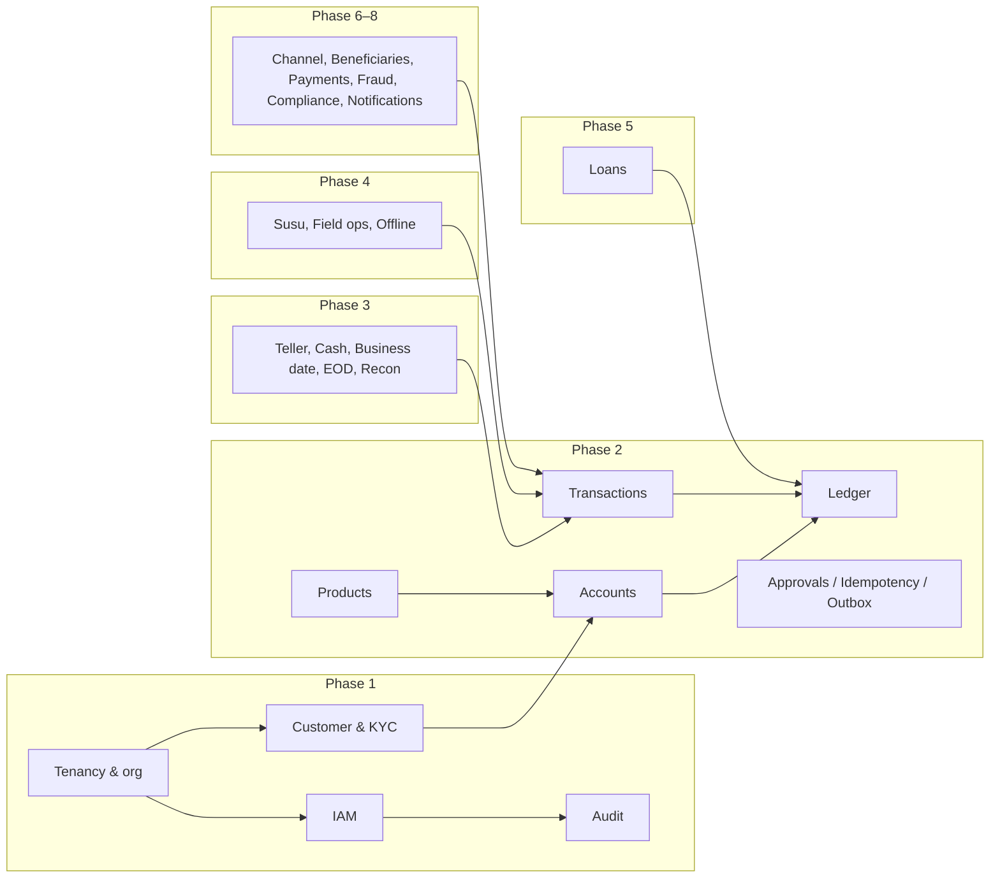
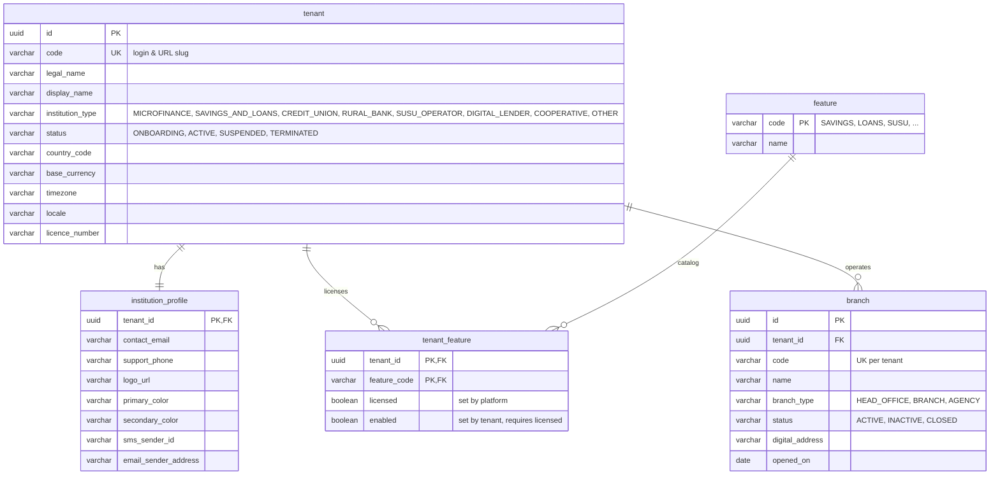
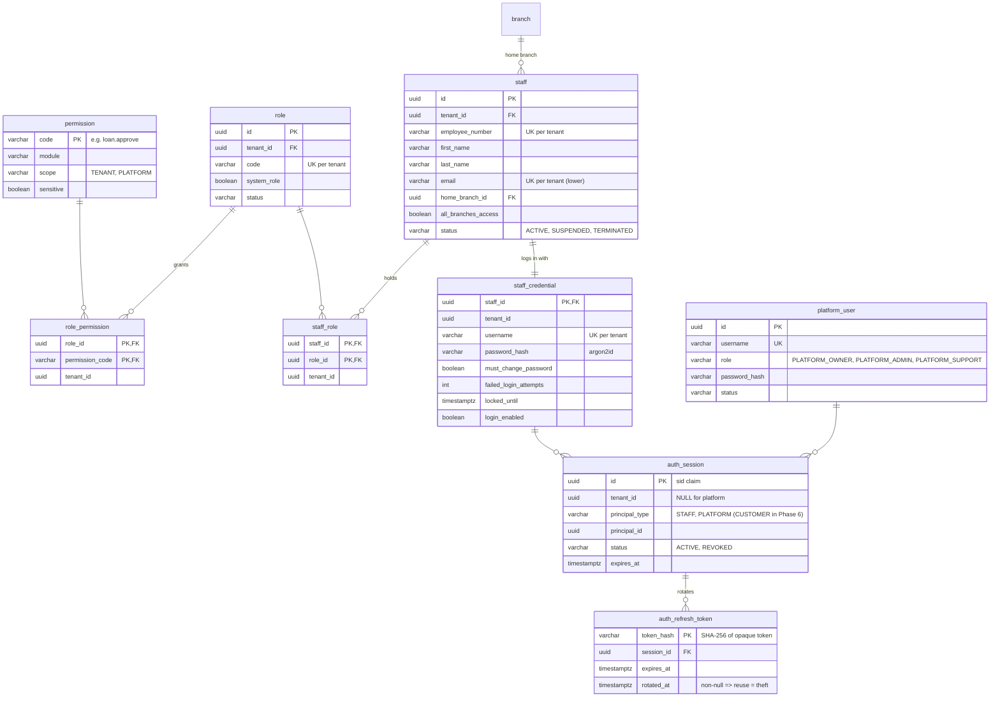
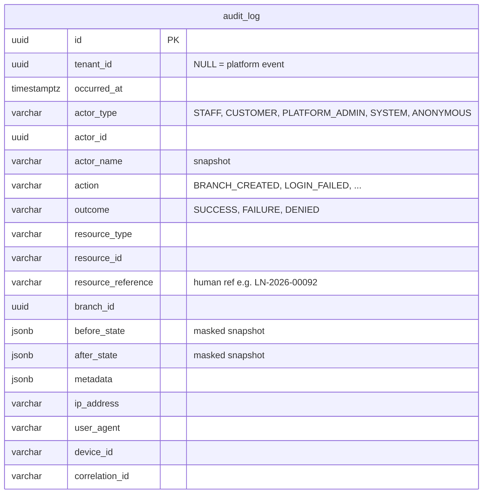
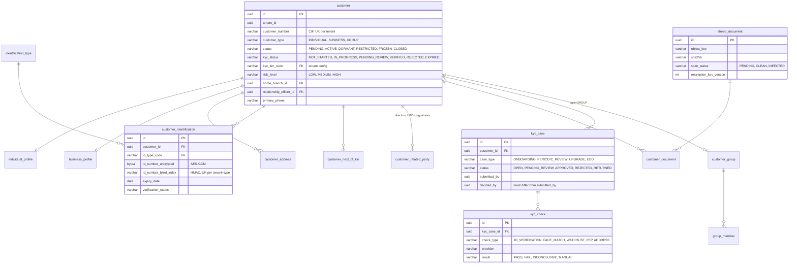
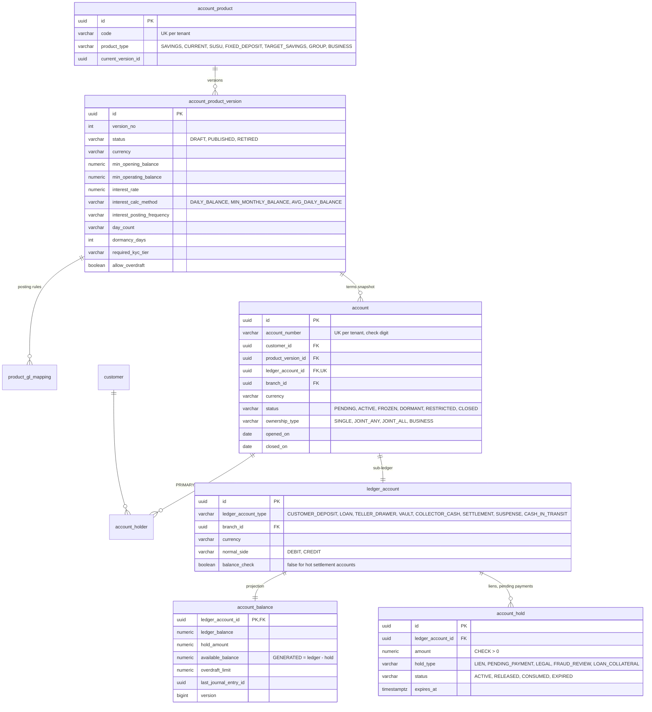
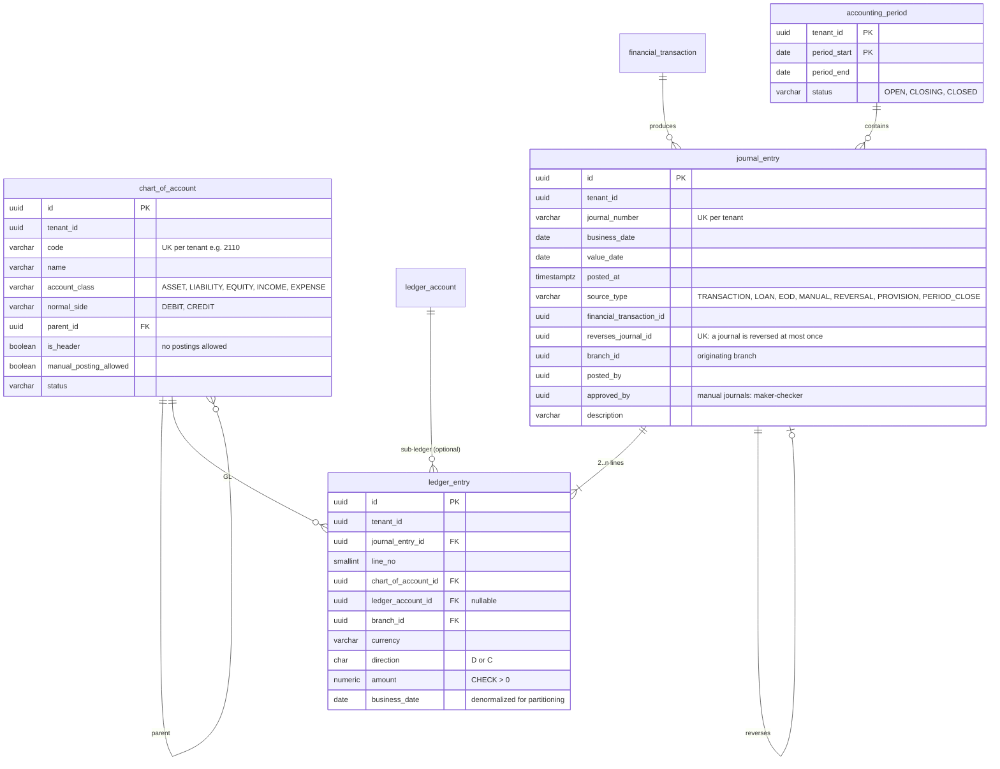
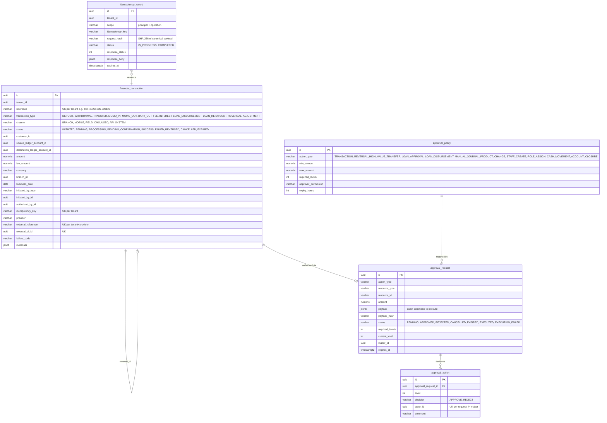
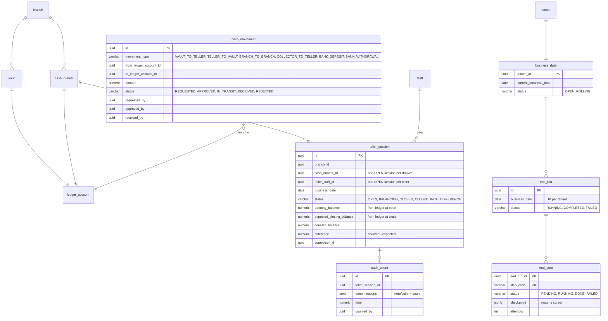
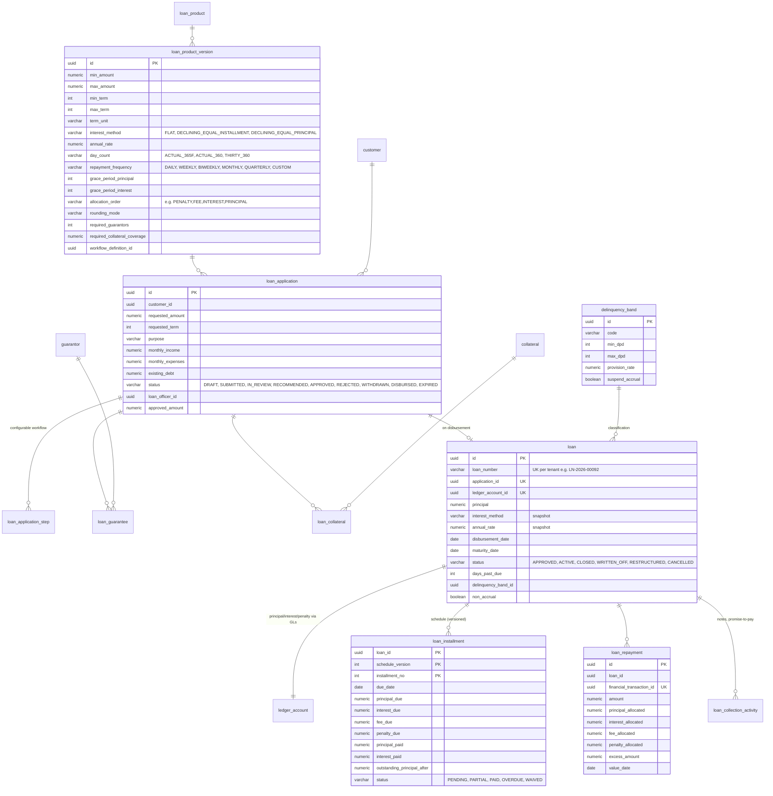

# 03 — PostgreSQL Domain Model & ERD

Status: **Phase 1 tables final (implemented in Flyway). Later-phase tables are the logical model; columns get finalized when that phase starts, but the keys, ownership and invariants below are binding.**

---

## 1. Global conventions

| Rule | Detail |
|---|---|
| Schema | All objects in schema `core`. Owned by `banking_migrator`; runtime role `banking_app` gets explicit grants per table. |
| Primary keys | `uuid`, UUIDv7, generated by the application. Pure association tables use composite PKs. |
| Tenant column | Every tenant-owned table has `tenant_id uuid NOT NULL` → `tenant(id)`, plus `UNIQUE (tenant_id, id)` so children can use **composite FKs** `(tenant_id, parent_id) → parent(tenant_id, id)`. A child can never point at another tenant's row, even through a bug. |
| Row-Level Security | `ENABLE ROW LEVEL SECURITY` + policy `tenant_id = core.current_tenant_id()` on every tenant-owned table (helper `core.apply_tenant_isolation(table)`). Tables that also hold platform rows (`audit_log`, `auth_session`) use `tenant_id IS NOT DISTINCT FROM core.current_tenant_id()`. |
| Timestamps | `timestamptz`, stored in UTC. `created_at`, `updated_at` on mutable tables; `created_by`, `updated_by` (actor uuid). |
| Business dates | `date` columns named `business_date` / `value_date`, distinct from timestamps. |
| Optimistic locking | `version bigint NOT NULL DEFAULT 0` on mutable aggregates. |
| Money | `NUMERIC(19,4)` for amounts and balances (supports 0–3 decimal currencies); `NUMERIC(24,10)` for accrual intermediates; `NUMERIC(9,6)` for rates (annual %, e.g. `28.500000`). Currency `varchar(3)` ISO-4217 with `CHECK (currency ~ '^[A-Z]{3}$')`. |
| Enums | `varchar` + `CHECK (col IN (…))` for **system** state machines (statuses). Tenant-configurable classifications (KYC tiers, ID types, delinquency bands, susu frequencies…) are **rows in config tables**, never CHECK constraints. |
| Deletion | Master data is never hard-deleted; it moves to status `INACTIVE`/`CLOSED`. Financial and audit tables are **insert-only** (no `UPDATE`/`DELETE` grant + trigger). |
| Naming | `pk_`, `fk_`, `uq_`, `ck_`, `ix_` prefixes. |
| Partition-readiness | High-volume append tables (`ledger_entry`, `audit_log`, `financial_transaction`, `notification`) carry their natural range key (`business_date` / `occurred_at`) and have **no FKs pointing into them**, so they can be range-partitioned later without redesign. |

### 1.1 Tenant isolation, all three layers

```sql
-- 1. The tenant comes from the authenticated token and is set per DB transaction
SELECT set_config('app.tenant_id', '<uuid from JWT>', true);   -- transaction-local

-- 2. RLS: fail-closed when the setting is missing
CREATE FUNCTION core.current_tenant_id() RETURNS uuid
  LANGUAGE sql STABLE AS $$ SELECT NULLIF(current_setting('app.tenant_id', true), '')::uuid $$;

ALTER TABLE core.branch ENABLE ROW LEVEL SECURITY;
CREATE POLICY tenant_isolation ON core.branch
  USING (tenant_id = core.current_tenant_id())
  WITH CHECK (tenant_id = core.current_tenant_id());

-- 3. Composite FKs: cross-tenant references are structurally impossible
ALTER TABLE core.staff ADD CONSTRAINT fk_staff_home_branch
  FOREIGN KEY (tenant_id, home_branch_id) REFERENCES core.branch (tenant_id, id);
```

`banking_app` is neither the table owner nor a superuser and has no `BYPASSRLS`. Platform-wide reporting will use a **separate** read-only role with `BYPASSRLS`, reachable only from audited break-glass code paths.

---

## 2. Domain map



---

## 3. Tenancy & organization (Phase 1, implemented)



| Table | Key constraints / notes |
|---|---|
| `tenant` | `UNIQUE(code)`, `code ~ '^[a-z0-9][a-z0-9-]{1,30}$'`. **Not** under RLS (registry, no customer data); only reachable through `TenantService`, which hands tenant users their own row only. |
| `institution_profile` | 1:1, RLS. Tenant-managed branding and contact details; colors `CHECK (~ '^#[0-9A-Fa-f]{6}$')`. |
| `feature` | Platform catalog seeded by migration. |
| `tenant_feature` | `CHECK (licensed OR NOT enabled)`: a tenant can't switch on a feature it isn't licensed for. |
| `branch` | `UNIQUE(tenant_id, code)`, `UNIQUE(tenant_id, id)`; exactly one active `HEAD_OFFICE` per tenant (partial unique index). |

Later in this area: `tenant_setting` (typed, versioned settings such as password policy and session timeouts), `holiday` (Phase 3), `currency` (Phase 2), `number_sequence` (Phase 1B: gap-free per-tenant counters for CIF and account numbers, allocated via `UPDATE … RETURNING`).

---

## 4. Identity & access (Phase 1, implemented)



| Rule | Where enforced |
|---|---|
| Platform-scope permissions can't be granted to tenant roles | Service + integration test |
| No self role assignment, no self disable | Service |
| `staff_credential.username` stored lower-case; `UNIQUE (tenant_id, username)` | DB |
| One refresh token is valid per session at a time; presenting a rotated token revokes the session | Service + `auth_refresh_token.rotated_at` |
| Staff disabled or terminated ⇒ `login_enabled = false` and all sessions revoked | Service |
| Customer credentials (Phase 6) live in a **separate** `customer_credential` table with `device`, `transaction_pin` (HMAC-peppered Argon2id), `otp_challenge` | Phase 6 |

---

## 5. Audit (Phase 1, implemented)



- **Immutable:** `banking_app` has `SELECT, INSERT` only, and trigger `trg_audit_log_immutable` raises on `UPDATE`/`DELETE` even for the owner.
- Snapshots come from explicit audit DTOs, never entity serialization, so hashes, PINs and tokens can't leak into them.
- Indexes: `(tenant_id, occurred_at DESC)`, `(tenant_id, resource_type, resource_id)`, `(tenant_id, actor_id, occurred_at DESC)`, `(correlation_id)`.
- Phase 3 hardening: hourly hash-chain seal (`audit_seal`: range, Merkle root, signature) and export to WORM storage.

---

## 6. Customer & KYC (Phase 1B, implemented)

Implemented in `V6`–`V10`. Differences from the first sketch below: tier requirements are explicit boolean columns on `kyc_tier` (identification, ID document, selfie, address, proof of address, identity verification, next of kin, signature, employment info); `kyc_case` carries the customer's `branch_id` so review queues can be filtered by branch scope; documents are split into `stored_document` (encrypted object metadata, owned by the `document` module) and `customer_document` (type and review state). Group customers (`customer_group`, `group_member`) move to Phase 4 with group lending. Details: [05-phase1-blueprint.md §8](05-phase1-blueprint.md), [data protection](../security/data-protection.md).



Also: `individual_profile` (names, DOB, gender, nationality, occupation, employer, income band, encrypted tax id, photo/signature document ids), `business_profile` (registered name, registration number, sector, turnover band), `customer_address` (type, lines, city, region, country, **digital_address**, primary flag), `customer_next_of_kin`, config tables `identification_type`, `kyc_tier` (per tenant: required documents and checks, default limits).

Identity verification sits behind a **port**: `IdentityVerificationProvider` (`verify(IdentityDocument) → VerificationResult`) with a `GhanaCardVerificationProvider` adapter added only when an approved provider contract exists.

---

## 7. Products, accounts & balances (Phase 2)



**Balance invariants**

- `account_balance.ledger_balance` = Σ(`ledger_entry.amount` on the normal side) − Σ(opposite side) for that `ledger_account_id`. A nightly reconciliation job proves it; any mismatch raises a `RECONCILIATION_BREAK` alert.
- `available_balance = ledger_balance − hold_amount` (generated column). For `balance_check = true` accounts: `CHECK (ledger_balance - hold_amount + overdraft_limit >= 0)`. The database itself refuses an overdraft.
- `hold_amount` = Σ active holds, maintained in the same transaction as hold changes.
- Withdrawals and transfers lock **all** affected `account_balance` rows with `SELECT … FOR UPDATE ORDER BY ledger_account_id` before checking funds.
- The minimum operating balance is a product rule, checked in the service on top of the DB constraint.

---

## 8. Ledger (Phase 2): the financial source of truth



**Ledger invariants (DB-enforced, not just application)**

1. **Balanced:** deferred constraint trigger `trg_journal_balanced` (`DEFERRABLE INITIALLY DEFERRED`) verifies at commit, for each journal, Σ debits = Σ credits **per currency and per branch**. The Posting Engine checks first and the database checks again.
2. **Immutable:** `banking_app` has only `SELECT, INSERT` on `journal_entry` and `ledger_entry`, and triggers reject `UPDATE`/`DELETE`.
3. **Postable accounts only:** an entry may not reference a header GL account, or a GL that doesn't match the ledger account's type (checked by the engine, verified in tests).
4. **Open period:** `business_date` must fall in an `OPEN` accounting period.
5. **Reversal:** a reversal journal mirrors every line with the opposite direction, references `reverses_journal_id` (unique), and posts on the **current** business date.

**Posting examples**

| Event | Debit | Credit |
|---|---|---|
| Cash deposit at teller | 1110 Branch Cash ‹teller drawer› | 2110 Savings Deposits ‹customer account› |
| Withdrawal at teller | 2110 ‹customer account› | 1110 ‹teller drawer› |
| Internal transfer + fee | 2110 ‹source› (amount + fee) | 2110 ‹destination› (amount), 4300 Transaction Fees (fee) |
| Inter-branch deposit (customer of A at branch B) | B: 1110 ‹drawer B› · A: 1910 Inter-branch Due-From B | A: 2110 ‹account› · B: 2910 Inter-branch Due-To A |
| Field collection | 1130 Cash with Collectors ‹officer› | 2110 ‹customer› |
| Collector remits to teller | 1110 ‹drawer› | 1130 ‹officer› |
| Loan disbursement to savings | 1200 Loan Principal ‹loan› | 2110 ‹customer› |
| Loan repayment (interest then principal) | 2110 ‹customer› | 4100 Interest Income, 1200 ‹loan› |
| MoMo payout (on provider SUCCESS) | 2110 ‹customer› | 1150 MoMo Settlement ‹provider› |

Derived balances: `gl_balance_snapshot (tenant_id, business_date, chart_of_account_id, branch_id, currency, opening, debits, credits, closing)` is written at EOD. Trial balance, balance sheet and income statement read snapshots plus the current-day delta.

---

## 9. Transactions, idempotency, approvals, outbox (Phase 2)



- **State machine** for `financial_transaction`: `INITIATED → PROCESSING → SUCCESS | FAILED`; external: `PROCESSING → PENDING_CONFIRMATION → SUCCESS | FAILED` (never by timeout alone); `SUCCESS → REVERSED` only via a linked `REVERSAL` transaction. Illegal transitions throw `IllegalTransactionStateException`.
- **Idempotency:** the `idempotency_record` insert and the money movement commit together. Same key + same hash returns the stored response. Same key + different hash returns `422 IDEMPOTENCY_KEY_REUSED`. A concurrent duplicate blocks on the unique index and then sees `COMPLETED`.
- **Maker-checker:** the approval executes the **stored payload** (checked by hash), not a re-submitted request. Execution is idempotent (`EXECUTED` once). The maker can never act, and the same checker can't approve twice. Thresholds come from `approval_policy` (e.g. 0–5,000 single authorization; 5,001–50,000 one supervisor; >50,000 two levels).
- `outbox_event (id, tenant_id, aggregate_type, aggregate_id, event_type, payload jsonb, occurred_at, published_at, attempts)`: written in the business transaction and drained by the worker.
- `charge_definition` / `charge_rule` (fee and tax engine): flat / percentage / tiered, min/max, GL income account, insufficient-funds policy.

---

## 10. Teller, cash, business date & EOD (Phase 3)



- Teller expected balance is **always read from the ledger** (`account_balance` of the drawer's ledger account), never summed from a side table. Shortage/overage posts on close (Dr 1190 Teller Shortages / Cr drawer, or Dr drawer / Cr 4900 Cash Overages) after supervisor approval.
- Cash in transit: `Dr 1140 Cash-in-Transit / Cr source` on dispatch, `Dr destination / Cr 1140` on receipt.
- EOD: (1) roll `business_date` (new postings carry D+1), (2) run steps for D, each idempotent and keyed by `(tenant, business_date, step, entity)`. Holidays come from the `holiday` table.

---

## 11. Field operations & susu (Phase 4)

| Table | Key columns & invariants |
|---|---|
| `field_officer` | `staff_id` PK, `collector_ledger_account_id` (cash with collector), daily target, `max_offline_amount`, `max_offline_hours`. |
| `customer_assignment` | customer ↔ officer with `assigned_from/to`; partial unique index: one active assignment per customer. |
| `field_device` | registered device, public key, `last_sequence_no`; revocable. |
| `collection` | `client_reference uuid` **UK per tenant** (offline idempotency), `(device_id, device_sequence_no)` UK, target (`SAVINGS_ACCOUNT, SUSU_PLAN, LOAN`), amount, `collected_at` (device), `received_at` (server), optional geo, `status RECEIVED → POSTED / REJECTED / DUPLICATE / CONFLICT`, `financial_transaction_id`. |
| `customer_visit` | officer, customer, purpose, outcome, notes, geo, `client_reference` UK. |
| `susu_plan` | linked `account_id`, frequency (tenant-configured `susu_frequency`), contribution amount, target, start, expected maturity, collector, missed-contribution policy, commission rule (`CYCLE_COMMISSION` etc.). |
| `susu_contribution` | expected period/date, amount, status `EXPECTED, PAID, MISSED, WAIVED`, `collection_id`/`financial_transaction_id`. |

---

## 12. Loans (Phase 5)



- Loan balances (principal, interest receivable, penalty) are **ledger-derived**: Σ entries for the loan's `ledger_account_id` per GL. `loan_installment` is the contractual plan plus allocation tracking, not the balance of record.
- `CHECK (amount = principal_allocated + interest_allocated + fee_allocated + penalty_allocated + excess_amount)` on `loan_repayment`.
- Restructure creates `schedule_version + 1`; old versions stay readable. Write-off requires `approval_request`, posts a journal and moves the loan to `WRITTEN_OFF` with recovery tracking.
- `guarantor` (person, optionally an existing `customer_id`), `loan_guarantee` (guaranteed amount, verification, signed document), `collateral` (category, description, estimated & forced-sale value, valuation date, valuer, location, documents/photos, verification, release status), `loan_collateral` (pledged value).

---

## 13. Channel, payments, compliance, notifications (Phases 6–8)

| Table | Purpose / key invariants |
|---|---|
| `customer_credential`, `customer_device`, `transaction_pin`, `otp_challenge` | Separate customer identity store; device binding with public key; PIN = Argon2id(HMAC(pepper, pin)); OTP stored as HMAC with TTL and attempt counter. |
| `beneficiary` | INTERNAL / BANK / MOBILE_MONEY; encrypted destination + blind index; `status PENDING_COOLDOWN → ACTIVE`; per-beneficiary limits; favourite. |
| `standing_order` | Scheduled / recurring transfers (target-savings auto-debit, loan auto-repay). |
| `integration_transaction` | One row per provider call: `internal_reference` UK, `external_reference`, status incl. `PENDING_CONFIRMATION`, `next_check_at`, redacted payloads. |
| `webhook_event` | `UNIQUE(provider, provider_event_id)` (replay protection), signature validity, processing status. |
| `reconciliation_run`, `reconciliation_item` | Type (`MOMO_PROVIDER, BANK, TELLER_CASH, VAULT, LEDGER_VS_BALANCE, SETTLEMENT`), expected vs actual, difference, match status, investigation status. |
| `fraud_rule`, `fraud_alert` | Parameterized rules (velocity, new-device + amount, odd hours…) → action `ALLOW, CHALLENGE, HOLD, REVIEW, REJECT, FREEZE`. |
| `compliance_case`, `watchlist_screening`, `customer_risk_assessment` | AML/CDD/EDD casework, screening hits, explainable risk scores. |
| `notification_template`, `notification` | Per-tenant templates per event/channel/locale; delivery tracking; no balances or secrets in push payloads. |
| `api_client` | Partner/integration credentials (hashed secret, scopes, IP allow-list). |

---

## 14. Data lifecycle

| Data | Retention approach |
|---|---|
| Ledger, transactions, audit | Never deleted by the application; archived by partition per regulatory retention period (configuration, to be set from legal review). |
| Sessions, refresh tokens, idempotency records | Purged after expiry + grace by a scheduled job (the only DELETE grants in the system, scoped to those tables). |
| KYC documents | Retained per policy after relationship end; then crypto-shredded (delete the data key). |
