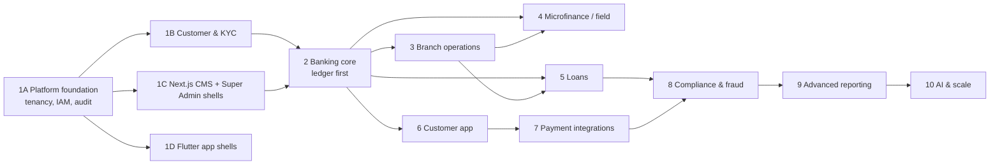

# 04 — Development Roadmap

Each phase ends with an **exit gate**. The next phase does not start until the gate passes. The order follows dependencies: nothing is built on a module whose correctness hasn't been proven.

## Phase 1: Foundation

Status: **1A done** (2026-10-06), **1B done** (2026-10-07), **1C done** (2026-10-07; Playwright smoke suite written, not yet run against a live stack), **1D done** (2026-10-08; Android/iOS builds not yet produced, see blueprint §11). Phase 1 complete.

| Step | Deliverables | Exit gate |
|---|---|---|
| **1A Platform foundation** | Monorepo, docker-compose (PostgreSQL 18, Redis), Spring Boot skeleton, common kernel (API envelope, errors, correlation IDs, UUIDv7), **tenant context + RLS + tenant-aware transaction manager**, Flyway baseline, `tenant` (registry, institution profile, branding, features), `branch`, `iam` (permissions catalog, roles, staff credentials, login/refresh/logout/password change, lockout, rate limiting, sessions), `staff`, `platform` (platform users, tenant onboarding, licensing), `audit`, OpenAPI, dev seed data, CI workflow. | All integration tests pass against real PostgreSQL, including **cross-tenant isolation tests at API and RLS level**, refresh-token reuse detection, lockout, and the permission matrix. ArchUnit rules green. |
| **1B Customer & KYC** | `number_sequence`, `customer` (individual/business/group), profiles, addresses, identifications (encrypted + blind index), next of kin, related parties, documents (MinIO object storage, scan status), `kyc_case` / `kyc_check` with maker-checker review, identity-verification port + stub provider, KYC tiers/ID types as tenant config, branch data-scope enforcement. Staff TOTP MFA. | KYC reviewer ≠ submitter enforced; PII never in logs/audit snapshots (test); customer search across 100k seeded rows < 300 ms. |
| **1C Web shells** | npm workspace, `packages/ui` (tokens + primitives), typed `api` package, server-only `bff` package, CMS: BFF auth (HttpOnly cookies), sidebar shell, dashboard placeholder, branches, staff, roles, audit log, institution settings, customers/KYC screens. Super Admin: login, tenants list/onboarding, feature licensing. | Vitest + Playwright smoke green; no token reachable from `document.cookie` or JS; permission-gated navigation tests. |
| **1D Flutter shells** | Pub workspace, `banking_core` (Dio, auth, secure storage, Money), `banking_ui` design system with widget tests, customer app and field app shells: branding bootstrap, login, home skeleton. | Widget tests green; no `double` in money code (lint rule). |

## Phase 2: Banking core (ledger first)

Status: **done** (2026-10-09; backend and CMS screens, see [Phase 2 blueprint](06-phase2-blueprint.md) for the exit gate evidence and the follow-ups).

Order inside the phase is strict:

1. `currency`, `accounting_period`, `chart_of_account` (default chart template per institution type), `ledger_account`.
2. **Posting Engine** + `journal_entry`/`ledger_entry` + DB triggers (balanced, immutable) + `account_balance` projection.
3. **Ledger gate:** property-based tests (random balanced/unbalanced journals), concurrency tests, reversal tests, inter-branch balancing tests, ledger-vs-projection reconciliation test.
4. `idempotency_record`, `outbox_event`.
5. `account_product` + versions, product GL mappings, `account`, holders/mandates, holds, limits.
6. Deposits, withdrawals (CMS-initiated, no teller drawer yet: posts against a branch cash GL), internal transfers, `charge` engine.
7. Reversals, `approval` (maker-checker with thresholds), statements (PDF/CSV).

**Exit gate:** the full spec §64 test set passes (deposit/withdraw balances, debit = credit, idempotent retry posts once, concurrent withdrawals never overdraw, cross-tenant access rejected); 10k concurrent-transfer soak test with zero reconciliation breaks.

## Phase 3: Branch operations

Business date + holidays → vault & drawers (ledger accounts) → teller sessions & cash counts → cash movements & cash-in-transit → teller transactions (deposit/withdrawal now post to the drawer) → EOD framework (resumable steps) → reconciliation (teller, vault, ledger vs balance) → dormancy job → audit hash-chain sealing.
**Gate:** EOD killed at every step and re-run produces identical results; teller expected balance always equals ledger.

## Phase 4: Microfinance

Field officers & collector cash ledger → customer assignment → susu products/plans/contributions → collections API with offline idempotency (client reference + device sequence) → visits → Field app offline queue (Drift + SQLCipher) & sync status → collector remittance to teller.
**Gate:** replaying the same offline batch 3× posts once; device sequence gaps raise alerts; officer cash position reconciles.

## Phase 5: Loans

Loan products/versions → schedule calculator (all methods, day counts, rounding) **with exhaustive unit tests** → applications & configurable workflow → guarantors & collateral → assessment & recommendation → approval (maker-checker) → disbursement (posting) → repayments with allocation waterfall → accrual, penalties, DPD, delinquency bands, non-accrual, provisioning → collections activity, restructure, write-off.
**Gate:** Σ installment principal = disbursed principal for every method/frequency combination; golden-file tests vs independently computed schedules.

## Phase 6: Customer app

Customer credentials, device binding, PIN, OTP, step-up → onboarding (12 progressive stages) → accounts, activity, transfers, beneficiaries (cooldown), statements, loans view, susu/target savings, notifications (push/SMS/email via outbox) → session & device management.

## Phase 7: Payment integrations

`PaymentProvider` port → sandbox adapters (MoMo providers, bank/switch, gateway) behind feature flags → webhooks (signature, replay protection) → `PENDING_CONFIRMATION` resolver job → settlement & reconciliation → suspense handling.

## Phase 8: Compliance & fraud

Rules engine (velocity, device, amount, time, beneficiary churn, staff–customer links) → alerts & actions → AML monitoring scenarios → compliance cases & STR workflow → watchlist screening port → risk classification → restrictions.

## Phase 9: Advanced reporting

Read-replica reporting module → financial statements (TB, BS, IS, cash flow) from GL snapshots → portfolio (PAR30/PAR90, disbursement, collections) → operational reports → PDF/Excel/CSV exports → scheduled reports → executive dashboards.

## Phase 10: AI & scale

AI credit assistant (explainable, advisory only, human decision recorded) → fraud anomaly models → support assistant (scoped to the customer's own data via the API, never direct DB) → Kafka relay from the outbox → service extraction **only** where load or team boundaries justify it (likely candidates: notifications, payment gateway, reporting).

## Standing rules for every phase

- Each module ships with migration, entities, repositories, DTOs, validators, services, controllers, security, exceptions, audit, unit tests, integration tests, OpenAPI docs and a "how to run" note (spec §75).
- No `TODO` in shipped code unless it references an intentionally deferred roadmap item.
- Documentation in `/docs` is updated in the same change as the code.
