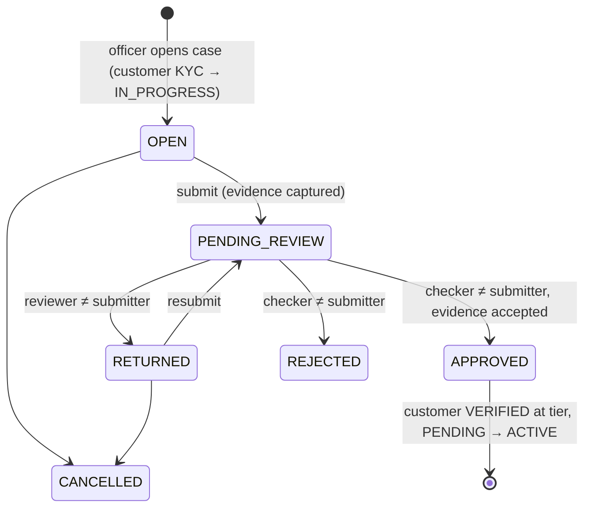

# 05 — Phase 1 Technical Blueprint

Phase 1 is split into four increments (see [04-roadmap.md](04-roadmap.md)). This document specifies **1A, platform foundation**, which is implemented in `backend/banking-core`. 1B–1D are outlined at the end.

## 1. Scope of 1A

| Module | Built in 1A |
|---|---|
| `common` | API envelope, error model, global exception handler, correlation-id filter, UUIDv7, `TenantContext`, tenant-aware transaction manager (RLS), base auditable entity, actor model, OpenAPI config. |
| `audit` | `audit_log` (immutable), `AuditService` (joined and independent transactions), query API. |
| `tenant` | Tenant registry, institution profile & branding, feature catalog & tenant licensing/enablement, public branding endpoint. |
| `branch` | Branch CRUD + status, branch data scope. |
| `iam` | Permission catalog, roles, staff credentials, platform users, login (staff & platform), refresh rotation with reuse detection, logout, password change, lockout, rate limiting, JWT issuance/validation, per-request session check, Spring Security config. |
| `staff` | Staff profiles, creation with temporary password, update, role assignment, suspend/reactivate/terminate, credential reset, `/me`. |
| `platform` | Platform tenant onboarding, tenant status, feature licensing, platform audit view, first-admin bootstrap, local demo seed data. |

## 2. Migrations

| File | Contents |
|---|---|
| `V1__baseline.sql` | Schema grants, `core.current_tenant_id()`, `core.apply_tenant_isolation(regclass)`, `core.reject_mutation()` trigger function. |
| `V2__tenancy.sql` | `tenant`, `institution_profile`, `feature` (+ seed catalog), `tenant_feature`. |
| `V3__branch.sql` | `branch` (+ one head office per tenant). |
| `V4__iam.sql` | `permission` (+ seed catalog), `role`, `role_permission`, `staff`, `staff_credential`, `staff_role`, `platform_user`, `auth_session`, `auth_refresh_token`. |
| `V5__audit.sql` | `audit_log` + immutability trigger + indexes. |

`staff` is created in `V4` because `staff_credential` references it. It belongs to the `staff` module.

## 3. API surface (all under `/api/v1`)

| Method & path | Permission | Notes |
|---|---|---|
| `POST /auth/staff/login` | public, rate-limited | `{tenantCode, username, password}` → tokens |
| `POST /platform/auth/login` | public, rate-limited | `{username, password}` → tokens (`aud=platform`) |
| `POST /auth/token/refresh` | public | `{refreshToken}` → rotated tokens |
| `POST /auth/logout` | authenticated | revokes current session |
| `POST /auth/password` | authenticated | change own password → all sessions revoked, fresh tokens |
| `GET /me` | staff | profile, roles, permissions, branch scope |
| `GET /public/institutions/{code}/branding` | public | white-label bootstrap for apps |
| `GET /institution` | `institution.view` | profile, branding, features |
| `PUT /institution/profile` | `institution.manage` | optimistic `version` |
| `PUT /institution/branding` | `institution.manage` | optimistic `version` |
| `PUT /institution/features/{code}` | `institution.manage` | enable/disable within licence |
| `GET /branches`, `GET /branches/{id}` | `branch.view` | filtered by branch scope |
| `POST /branches` | `branch.manage` | requires all-branch scope |
| `PUT /branches/{id}` | `branch.manage` | `version` |
| `POST /branches/{id}/status` | `branch.manage` | `{status, reason}` |
| `GET /permissions` | `permission.view` | tenant-scope catalog |
| `GET /roles`, `GET /roles/{id}` | `role.view` | |
| `POST /roles` | `role.manage` | tenant-scope permissions only |
| `PUT /roles/{id}` | `role.manage` | not a role the actor holds; `version` |
| `GET /staff`, `GET /staff/{id}` | `staff.view` | filtered by branch scope |
| `POST /staff` | `staff.create` | returns one-time temporary password |
| `PUT /staff/{id}` | `staff.edit` | not self |
| `PUT /staff/{id}/roles` | `role.assign` | not self; revokes target sessions |
| `POST /staff/{id}/status` | `staff.disable` | not self; suspend/terminate revoke sessions |
| `POST /staff/{id}/credentials/reset` | `staff.unlock` | not self; unlock + temp password |
| `GET /audit-logs` | `audit.view` | filters + paging |
| `GET /platform/tenants`, `GET /platform/tenants/{id}` | `platform.tenant.view` | registry only, no tenant financial data |
| `POST /platform/tenants` | `platform.tenant.manage` | onboarding (tenant, profile, features, roles, head office, first admin) |
| `POST /platform/tenants/{id}/status` | `platform.tenant.manage` | suspension revokes all tenant sessions |
| `PUT /platform/tenants/{id}/features/{code}` | `platform.feature.manage` | licence on/off (off also disables) |
| `GET /platform/features` | `platform.tenant.view` | catalog |
| `GET /platform/audit-logs` | `platform.audit.view` | platform-level events only |
| `GET /platform/me` | platform | |

Response envelope: `{ success, message, data, timestamp }`. Errors: `{ success:false, code, message, timestamp, traceId, errors[] }`.

## 4. Error codes introduced in 1A

| Code | HTTP | When |
|---|---|---|
| `VALIDATION_FAILED` | 400 | DTO validation; `errors[]` has field details |
| `MALFORMED_REQUEST` | 400 | unreadable JSON, type mismatch |
| `UNAUTHENTICATED` | 401 | missing/invalid/expired token |
| `INVALID_CREDENTIALS` | 401 | any login failure that must not reveal why |
| `INVALID_REFRESH_TOKEN` | 401 | unknown, expired, reused or revoked refresh token |
| `SESSION_REVOKED` | 401 | token's session no longer active |
| `ACCESS_DENIED` | 403 | missing permission or outside branch scope (writes) |
| `PASSWORD_CHANGE_REQUIRED` | 403 | temporary password must be changed first |
| `ACCOUNT_DISABLED` | 403 | staff suspended/terminated or tenant suspended |
| `SELF_MODIFICATION_NOT_ALLOWED` | 403 | acting on own roles/status/credentials/held role |
| `RESOURCE_NOT_FOUND` | 404 | includes other-tenant and out-of-scope reads |
| `DUPLICATE_RESOURCE` | 409 | unique business key taken |
| `CONCURRENT_MODIFICATION` | 409 | stale `version` |
| `ACCOUNT_LOCKED` | 423 | too many failed logins |
| `BUSINESS_RULE_VIOLATION` | 422 | generic rule failure (specific codes preferred) |
| `PASSWORD_POLICY_VIOLATION` | 422 | weak or reused password |
| `FEATURE_NOT_LICENSED` | 422 | enabling an unlicensed feature |
| `INVALID_PERMISSION` | 422 | unknown or platform-scope permission on a tenant role |
| `INVALID_STATE_TRANSITION` | 422 | e.g. reactivating a terminated staff member |
| `RATE_LIMITED` | 429 | throttled |
| `INTERNAL_ERROR` | 500 | anything unexpected (logged with trace id, no details returned) |

## 5. Configuration (`banking.*`)

| Property | Default | Notes |
|---|---|---|
| `banking.security.jwt.issuer` | `banking-core` | |
| `banking.security.jwt.access-token-ttl` | `PT10M` | |
| `banking.security.jwt.private-key` / `public-key` | — | PEM resource locations; **required outside local/test** |
| `banking.security.jwt.allow-ephemeral-keys` | `false` | `true` in `local`/tests only |
| `banking.security.session.staff-absolute-ttl` / `staff-idle-ttl` | `PT12H` / `PT30M` | refresh token TTL = idle TTL |
| `banking.security.session.platform-absolute-ttl` / `platform-idle-ttl` | `PT4H` / `PT15M` | |
| `banking.security.lockout.max-failed-attempts` / `duration` | `5` / `PT30M` | |
| `banking.security.rate-limit.store` | `redis` | `in-memory` for tests |
| `banking.security.rate-limit.login-per-ip` / `login-per-username` | `30/PT1M` / `10/PT5M` | |
| `banking.platform.bootstrap.*` | unset | creates the first platform owner if none exists |
| `banking.cors.allowed-origins` | `[]` | BFF origins |

## 6. Key flows

Detailed sequences: [../security/authentication.md](../security/authentication.md). Permission catalog and default roles: [../security/roles-and-permissions.md](../security/roles-and-permissions.md).

## 7. Test plan (1A)

| Test | Type | Proves |
|---|---|---|
| `UuidV7Test`, `PasswordServiceTest`, `RefreshTokenCodecTest`, `BranchScopeTest`, `InMemoryRateLimiterTest`, `AccessTokenServiceTest`, `StatusTransitionTest` | unit | building blocks: IDs, password policy, token format, JWT round-trip/expiry/foreign key, state machines |
| `ArchitectureTest` | unit (ArchUnit) | module rules, no cycles, entities/repositories private to their module, controllers ↛ repositories, no field injection, only approved flows may switch tenant |
| `DatabaseSecurityIT` | integration | RLS hides rows without tenant context; WITH CHECK blocks cross-tenant insert; audit log can't be updated/deleted; app role isn't owner |
| `TenantIsolationIT` | integration | staff of tenant A gets 404 for tenant B branch/staff/role; lists never contain B rows |
| `StaffAuthenticationIT` | integration | login, wrong password, unknown tenant, lockout, refresh rotation, **reuse detection**, logout, password-change-required, disabled staff, audience separation |
| `BranchApiIT` | integration | CRUD, validation, duplicate, optimistic lock, permission denied, audit written, scope filtering |
| `RoleAndStaffApiIT` | integration | platform permission rejected, self-modification blocked, role assignment revokes sessions, suspend blocks login |
| `PlatformOnboardingIT` | integration | onboarding end-to-end, first admin login, tenant suspension, licensing rules |
| `PermissionCatalogIT` | integration | DB catalog == code constants; **every endpoint has a catalogued permission** unless deliberately public; role templates respect segregation of duties |
| `OpenApiDocumentationIT` | integration | both API groups generate, with bearer auth and the shared error schema |
| `LocalDemoDataSeederIT` | integration | demo institution seeds correctly, every demo user signs in with the right role, re-running is a no-op |

**Result at completion of 1A:** 96 tests (48 unit, 48 integration), all passing against PostgreSQL 18.

Integration tests run against **real PostgreSQL 18**: Testcontainers when Docker is available, otherwise embedded PostgreSQL binaries. The app connects as the restricted `banking_app` role, exactly as in production, so the RLS tests are meaningful.

## 8. Phase 1B: Customer & KYC (implemented)

### 8.1 Modules and migrations

| Module | Responsibility |
|---|---|
| `common.crypto` | `FieldEncryptionService`: AES-256-GCM with key versions and row-bound associated data; HMAC-SHA256 blind indexes; `Masking`. See [data protection](../security/data-protection.md). |
| `common.sequence` | `SequenceService`: gap-free per-tenant counters (row lock until commit); `CheckDigits` (Luhn). |
| `document` | `DocumentStorageService`: magic-byte type check (JPEG/PNG/PDF), SHA-256, malware-scanner port, encryption, `ObjectStorage` port (filesystem adapter now; S3-compatible adapter when hosting is decided). |
| `customer` | Customers (individual / business), profiles, addresses, identifications, next of kin, related parties, KYC documents, configurable identification types. `CustomerKycService` is the API the KYC module uses. |
| `kyc` | Configurable KYC tiers, KYC cases (capture → submit → review → four-eyes decision), checks (electronic via `IdentityVerificationProvider` port, or manual), requirement evaluation. |
| `iam` (extended) | TOTP MFA for staff and platform users; mandatory for platform administrators in deployed environments. |

| Migration | Contents |
|---|---|
| `V6__number_sequence.sql` | `number_sequence` |
| `V7__kyc_configuration.sql` | `identification_type`, `kyc_tier` (defaults provisioned per institution, country-aware) |
| `V8__customer.sql` | `customer` (+ `pg_trgm` indexes for name and phone search), `individual_profile`, `business_profile`, `customer_address`, `customer_identification`, `customer_next_of_kin`, `customer_related_party` |
| `V9__documents.sql` | `stored_document` (write-once metadata), `customer_document` |
| `V10__kyc.sql` | `kyc_case` (**DB check: decider ≠ submitter**, one undecided case per customer), `kyc_check` (append-only) |
| `V11__mfa.sql` | MFA columns on `staff_credential` and `platform_user` |

### 8.2 API

| Method & path | Permission | Notes |
|---|---|---|
| `GET /customers?q=&branchId=&status=&kycStatus=&customerType=` | `customer.view` | branch-scoped; `q` matches number (exact), name / phone (partial), email (exact) |
| `POST /customers` | `customer.create` | `PENDING`, KYC `NOT_STARTED`, 10-digit Luhn customer number |
| `GET /customers/{id}` | `customer.view` | profile, active contacts, masked identifications, documents |
| `PUT /customers/{id}` | `customer.edit`, or `customer.create` while onboarding | identity fields locked once verified |
| `POST /customers/{id}/status` | `customer.freeze` | restrict / freeze / reactivate / close |
| `POST·PUT·DELETE /customers/{id}/addresses[/{aid}]`, `/next-of-kin`, `/related-parties` | capture rule | related parties: business only, identity-locked once verified |
| `POST·DELETE /customers/{id}/identifications[/{iid}]` | capture rule | format, expiry and duplicate checks; identity-locked once verified |
| `GET /customers/{id}/identifications/{iid}/number` | `kyc.review` | full number, audited |
| `POST /customers/{id}/documents` (multipart) | capture rule | JPEG / PNG / PDF ≤ 10 MB |
| `GET /customers/{id}/documents`, `.../{did}/content` | `customer.view` / `kyc.view` | download audited |
| `POST /customers/{id}/documents/{did}/review` | `kyc.review` | reviewer ≠ uploader |
| `GET·POST·PUT /kyc/identification-types` | `customer.view` / `settings.manage` | |
| `GET·PUT /kyc/tiers` | `kyc.view` / `settings.manage` | |
| `POST /customers/{id}/kyc-cases`, `GET` | capture rule / `kyc.view` | `ONBOARDING`, `PERIODIC_REVIEW`, `UPGRADE`, `UPDATE` |
| `GET /kyc/cases?status=&branchId=`, `GET /kyc/cases/{id}` | `kyc.view` | queue oldest first, with requirement status and checks |
| `POST /kyc/cases/{id}/identity-check` | capture or `kyc.review` | provider called outside DB transactions |
| `POST /kyc/cases/{id}/checks` | `kyc.review` | manual check |
| `POST /kyc/cases/{id}/submit` · `/cancel` | capture rule | |
| `POST /kyc/cases/{id}/return` | `kyc.review` | four-eyes |
| `POST /kyc/cases/{id}/approve` · `/reject` | `kyc.approve` | four-eyes; watchlist/PEP hit ⇒ HIGH risk only |
| `POST /auth/mfa/totp/setup` · `/activate`, `POST /auth/mfa/verify` | authenticated / public | see [authentication](../security/authentication.md) |

"Capture rule": `customer.edit`, or `customer.create` while the customer is `PENDING`. Field officers can capture new customers but cannot alter established ones.

### 8.3 New error codes

`DUPLICATE_IDENTIFICATION`, `DUPLICATE_BUSINESS_REGISTRATION`, `CUSTOMER_PROFILE_MISMATCH`, `IDENTIFICATION_TYPE_NOT_ACCEPTED`, `INVALID_IDENTIFICATION_NUMBER`, `IDENTIFICATION_EXPIRY_REQUIRED`, `IDENTIFICATION_EXPIRED`, `KYC_UNDER_REVIEW`, `KYC_DATA_LOCKED`, `KYC_CASE_ALREADY_OPEN`, `KYC_CASE_TYPE_NOT_ALLOWED`, `KYC_TIER_NOT_AVAILABLE`, `KYC_REQUIREMENTS_NOT_MET`, `IDENTITY_VERIFICATION_UNAVAILABLE`, `HIGH_RISK_REQUIRED`, `FOUR_EYES_VIOLATION`, `UNSUPPORTED_DOCUMENT_TYPE` (415), `DOCUMENT_TOO_LARGE` / `PAYLOAD_TOO_LARGE` (413), `INVALID_MFA_CHALLENGE`, `INVALID_MFA_CODE`, `MFA_ALREADY_ENABLED`, `MFA_NOT_STARTED`, `MFA_ENROLLMENT_REQUIRED`.

### 8.4 KYC workflow

- **Submission** needs the tier's evidence *captured*: data present and documents uploaded and not rejected.
- **Approval** needs it *accepted*: documents accepted by a reviewer who did not upload them, and an identity-verification check passed (electronic, or manual by a reviewer).
- While a case is `PENDING_REVIEW` nothing on the customer can change. After approval, identity data is locked until an `UPDATE` case reopens it.

### 8.5 Exit gate results

| Gate | Evidence |
|---|---|
| KYC reviewer ≠ submitter | `KycWorkflowIT`: API returns `FOUR_EYES_VIOLATION`; direct SQL self-approval is rejected by `ck_kyc_case_four_eyes`; document uploader cannot accept own upload. |
| PII never in logs or audit snapshots | `PiiProtectionIT`: captured console output and every audit row contain no identity or tax number (or customer name/phone in logs); DB columns hold only ciphertext and masked values; stored files are encrypted. |
| Search across 100k customers < 300 ms | `CustomerSearchPerformanceIT`: through the full API on embedded PostgreSQL 18 on a developer laptop, medians ≈ 170 ms (partial name, ~6,700 matches), 90–115 ms (name+number, phone, customer number). |

## 9. Outline of 1C–1D

- **1C Web (done):** `web/` npm workspace; CMS and Super Admin over the 1A/1B API. See §10.
- **1D Mobile:** `mobile/` pub workspace; design system package and two app shells with branding bootstrap and login.

## 10. Phase 1C: web consoles (implemented)

**Packages.** `@banking/api` (contract types, browser client, permission codes), `@banking/bff` (server-only session, refresh, CSRF, proxy and auth handlers), `@banking/ui` (tokens, primitives, DataTable, Money, AppShell), `@banking/console` (providers, sign-in with MFA, password change, MFA enrolment, one-time credential dialog, audit viewer). The apps are `institution-cms` (port 3000) and `super-admin` (port 3001). Architecture details are in [01 §3](01-system-architecture.md#3-nextjs-architecture).

**Key decisions.**

| Decision | Why |
|---|---|
| BFF with sealed HttpOnly cookies, no tokens in JS | An XSS bug cannot exfiltrate tokens; spec rule "never expose secrets to client apps". |
| Hand-written AES-GCM sealing (Node `crypto`) instead of a session library | ~100 lines, fully tested, binds purpose and expiry, supports key rotation, no extra dependency. |
| Single-flight refresh + 20 s rotation grace | Backend refresh tokens are single-use with reuse detection; parallel requests must not sign users out. |
| Proxy allow-lists per app | The platform console physically can't reach tenant APIs and vice versa. |
| Nonce CSP, all pages dynamic | Strict `script-src` without `unsafe-inline`; the cost (no static pages) is irrelevant for authenticated consoles. |
| Search text kept out of page URLs | Names and phone numbers must not land in browser history. |
| Mutations never auto-retried | A retried write could duplicate a business action. |
| Zod schemas mirror Bean Validation; server field errors mapped back | Fast feedback, with the backend as the authority. |

**Exit gate.**

| Gate | Result |
|---|---|
| Vitest green | 119 tests across packages and apps (sealing, tamper/expiry/purpose binding, chunked cookies, CSRF, refresh single flight and grace, proxy allow-list and traversal, auth flows incl. MFA, forms, permission gating, money formatting beyond 2^53). |
| No token reachable from `document.cookie` or JS | Covered by unit tests (session never returned to the browser; HttpOnly attributes) and by the Playwright spec `e2e/smoke.spec.ts`. |
| Permission-gated navigation tests | Unit tests in both apps; Playwright teller-vs-admin check. |
| Production builds | `npm run build` succeeds for both apps (Turbopack, standalone output). |
| Playwright smoke | **Written but not yet executed**: it needs banking-core (local profile, PostgreSQL + Redis) and the CMS running, which this development machine can't host. Run it before the 1D gate. |

**Known follow-ups.** QR-code rendering for MFA enrolment (manual key and `otpauth://` link work today); ESLint and Recharts dashboards (deferred); POST-based customer search to keep search terms out of access logs; Redis-backed refresh coordination if BFF instances can't use sticky sessions.
