# 06 — Phase 2 Blueprint: Banking Core

Phase 2 builds the money core in the order the [roadmap](04-roadmap.md#phase-2-banking-core-ledger-first) fixes: ledger first, then idempotency and the outbox, then products and accounts, then money movement, then reversals, maker-checker and statements. Every module below is in `backend/banking-core`; the CMS screens built on it are listed in §11.

## 1. Modules and migrations

| Module | Responsibility |
|---|---|
| `ledger` | Currencies, accounting periods, chart of accounts (default template per institution type), sub-ledger accounts, the **posting engine** (the only writer of journals), balance projection, trial balance, reconciliation, statements of sub-ledger accounts. |
| `common.idempotency` | `IdempotencyService`: request keys stored in PostgreSQL in the same transaction as the money movement. |
| `common.outbox` | `OutboxService`: events written with the business transaction, relayed after commit with `SKIP LOCKED` and exponential backoff. |
| `product` | Deposit products and their **versioned terms** (limits, balances, interest settings, KYC tier, GL mapping, charges). |
| `account` | Customer accounts, holders (single, joint, business signatories), holds, lifecycle, statements (JSON, CSV, PDF). |
| `transaction` | Cash deposits, cash withdrawals, transfers, reversals; charge application; product limits. |
| `approval` | Maker-checker requests, thresholds, decisions; handlers registered by the modules that own the actions. |
| `manualjournal` | Manual GL journals, posted only after approval. |

| Migration | Contents |
|---|---|
| `V13__ledger.sql` | `currency`, `accounting_period`, `chart_of_account`, `ledger_account`, `account_balance`, `journal_entry`, `ledger_entry` and the triggers in §2 |
| `V14__idempotency_outbox.sql` | `idempotency_record`, `outbox_event` |
| `V15__deposit_accounts.sql` | `account_product`, `account_product_version` (published versions frozen by trigger), `account`, `account_holder`, `account_hold` (hold totals maintained by trigger) |
| `V16__transactions.sql` | `product_charge` (editable only on draft versions), `financial_transaction` (only reversal may change it), deferred FK from journals to transactions |
| `V17__approvals.sql` | `approval_policy`, `approval_request` (four eyes and decide-once enforced by the database), approver columns on `financial_transaction` |

## 2. Ledger invariants

The application checks every rule first and gives a clear error; the database enforces the same rules so that no code path, bug or manual SQL by the application role can break them.

| Invariant | Enforced by |
|---|---|
| Every journal balances per currency and per branch | deferred constraint trigger `journal_entry_check_balanced` (checked at commit); the engine adds inter-branch due-to/due-from lines automatically |
| Journals and entries are never updated or deleted | `reject_mutation` triggers on update, delete and truncate |
| Lines can only be added in the journal's own database transaction | `posting_txid` on `journal_entry` compared with `pg_current_xact_id()` |
| Postings only into open periods and postable GL accounts that match the sub-ledger account's GL, branch and currency | `ledger_entry_before_insert` (period row locked `FOR SHARE`) |
| A reversal mirrors its original exactly and happens at most once | `uq_journal_entry_reverses` + mirror check in the balance trigger |
| Balances move only with entries; a customer account never goes below zero minus its overdraft limit | `account_balance` written only by a `SECURITY DEFINER` trigger; `ck_account_balance_no_overdraft` (holds included) |
| Money is exact | `NUMERIC(19,4)` in the database, `BigDecimal` in Java, decimal strings in JSON; amounts more precise than the currency allows are refused |

**Posting engine.** `PostingEngine.post` resolves each line (sub-ledger account, GL account or system role such as `CASH_AT_BRANCH`), validates amounts and currencies, locks every touched balance row in ascending id order (no deadlocks between postings), checks funds, adds inter-branch lines, writes lines with balance-raising lines first (so no intermediate balance dips below the final one), and returns the new balances. `postApproved` and `reverseApproved` record the maker as poster and the current actor as approver; the database refuses a journal whose approver is its poster.

## 3. Products and accounts

- **Versioned terms (decision D9).** A product has versions: `DRAFT` (editable), `PUBLISHED` (offered to new accounts, frozen by trigger), `RETIRED` (still binding for accounts opened under it). Publishing a new version retires the previous one; existing accounts keep their terms.
- **GL mapping** defaults by product type (savings, current, susu, fixed and target deposits) and must be a liability GL; charges post to an income GL.
- **Charges** belong to a version: one per event (`CASH_DEPOSIT`, `CASH_WITHDRAWAL`, `TRANSFER_OUT`), flat or a percentage (rounded half up to the minor unit, then kept within the optional minimum and maximum). The `ChargeCalculator` is pure and unit-tested.
- **Opening rules.** Every holder must be an `ACTIVE` customer (KYC approved) in the caller's branch scope with at least the product's KYC tier; holder rows are locked in id order for the duration. Ownership: `SINGLE` (one individual), `JOINT_ANY`/`JOINT_ALL` (individuals), `BUSINESS` (business customer plus individual signatories). Account numbers are `1` + 8-digit sequence + Luhn digit. The account opens `PENDING` if the product needs an opening deposit and becomes `ACTIVE` when funded.
- **Lifecycle.** `PENDING`, `ACTIVE`, `RESTRICTED` (credits only), `FROZEN` (nothing moves), `DORMANT` (credits only; set by the dormancy job in Phase 3), `CLOSED` (zero balance and no holds; closes the ledger account). A customer who still owns an open account cannot be closed.
- **Holds** (lien, legal, fraud review) reserve funds up to what the account could pay out; the database keeps the hold total and its no-overdraft rule applies. Expired holds are released by a background job.

## 4. Money movement

| Step | Detail |
|---|---|
| 1. Idempotency | `Idempotency-Key` header required; scope = actor + operation. Same key and body ⇒ stored response replayed (`Idempotency-Replayed: true`); same key, different body ⇒ `IDEMPOTENCY_KEY_REUSED`; concurrent duplicates wait on the key's unique index. |
| 2. Locks | Accounts locked `FOR UPDATE` in id order (scope-checked), then balance rows by the engine. |
| 3. Rules | Status (credit/debit allowed), currency precision, product limits (per withdrawal, daily total of withdrawals and transfers out), minimum operating balance, maximum balance, funds (available balance incl. holds and overdraft). |
| 4. Threshold | Withdrawals and transfers at or above an active `approval_policy` are submitted for approval instead of posted (HTTP 202, `outcome: PENDING_APPROVAL`). |
| 5. Posting | One balanced journal (`TXN-yyyyMMdd-…` reference) with the charge lines; a `financial_transaction` row; account activity / activation; audit entry; `TRANSACTION_POSTED` outbox event — all in one database transaction. |

Cash moves through the branch cash GL until teller drawers arrive in Phase 3.

## 5. Maker-checker

```mermaid
stateDiagram-v2
    [*] --> PENDING: maker submits (reversal, manual journal, movement above threshold)
    PENDING --> APPROVED: checker ≠ maker, holds approval.act + the action's permission, branch in scope; action runs in the same transaction
    PENDING --> REJECTED: checker gives a reason
    PENDING --> CANCELLED: maker withdraws it
```

- The action is validated again when approved (balances may have changed). If it fails, everything rolls back and the request stays `PENDING`.
- The journal records the maker as poster and the checker as approver; the transaction records `initiated_by`, `approved_by` and the request id. The database refuses `decided_by = requested_by`, any change after a decision, and deletion.
- **Reversal** posts the exact mirror of the original journal (charges included) on the current business date; a spent deposit cannot be reversed (funds check).
- **Manual journals** may only touch GL accounts flagged for manual posting and never customer sub-ledger accounts.

## 6. Statements

Built from ledger entries, not from transaction rows, so charges and reversals appear exactly as posted. Opening balance = entries before the period; each line carries the running balance; the closing balance equals the account balance. JSON for screens; PDF (Apache PDFBox, standard fonts, A4) and CSV (UTF-8 with BOM, formula cells neutralised) downloads are audited and sent with `Cache-Control: no-store`. At most one year and 10,000 entries per statement.

## 7. API (all under `/api/v1`)

| Method & path | Permission | Notes |
|---|---|---|
| `GET·POST /ledger/chart-of-accounts`, `PUT /{id}` | `ledger.view` or `settings.view` (read), `settings.manage` | system accounts protected |
| `GET /ledger/journals`, `/journals/{id}`, `/trial-balance`, `/reconciliation`, `/periods`, `/currencies` | `ledger.view` | branch-scoped |
| `POST /ledger/periods/{periodStart}/close` | `ledger.post` | months close in order |
| `POST /ledger/manual-journals` | `ledger.post` | 202 + approval request |
| `GET·POST /products`, `GET·PUT /products/{id}` | `product.view` / `product.manage` | |
| `POST /products/{id}/versions`, `PUT /products/{id}/versions/{vid}`, `POST …/{vid}/publish` | `product.manage` | drafts only |
| `GET·POST /accounts`, `GET /accounts/{id}`, `GET /customers/{id}/accounts` | `account.view` / `account.create` | branch-scoped |
| `POST /accounts/{id}/status` · `/close` | `account.freeze` / `account.close` | optimistic version |
| `GET·POST /accounts/{id}/holds`, `POST …/holds/{hid}/release` | `account.view` / `account.freeze` | |
| `GET /accounts/{id}/statement`, `/statement/download?format=PDF|CSV` | `transaction.view` | download audited |
| `POST /transactions/deposits` · `/withdrawals` · `/transfers` | `transaction.create` | `Idempotency-Key` required; 201 posted / 202 pending approval |
| `GET /transactions/{id}`, `GET /accounts/{id}/transactions?from=&to=` | `transaction.view` | |
| `POST /transactions/{id}/reversal` | `transaction.reverse` | 202 + approval request |
| `GET /approvals?status=&type=`, `GET /approvals/{id}` | `approval.view` (makers see their own) | |
| `POST /approvals/{id}/approve` · `/reject` | `approval.act` + the action's permission | four eyes |
| `POST /approvals/{id}/cancel` | maker only | |
| `GET·PUT /approval-policies[/{type}/{currency}]` | `settings.view` / `settings.manage` | `CASH_WITHDRAWAL`, `TRANSFER` |

## 8. New error codes

Ledger: `UNBALANCED_JOURNAL`, `INVALID_POSTING`, `INVALID_AMOUNT`, `CURRENCY_NOT_SUPPORTED`, `GL_ACCOUNT_NOT_POSTABLE`, `GL_ACCOUNT_NOT_MANUAL`, `SYSTEM_ACCOUNT_MISSING`, `LEDGER_ACCOUNT_CLOSED`, `INSUFFICIENT_FUNDS`, `PERIOD_CLOSED`, `PERIOD_CLOSE_NOT_ALLOWED`, `JOURNAL_ALREADY_REVERSED`, `REVERSAL_NOT_ALLOWED`, `APPROVAL_REQUIRED`, `GL_ACCOUNT_IN_USE`, `SYSTEM_GL_ACCOUNT_PROTECTED`, `INVALID_PARENT_ACCOUNT`, `BRANCH_NOT_ACTIVE`. Idempotency: `IDEMPOTENCY_KEY_REQUIRED`, `INVALID_IDEMPOTENCY_KEY`, `IDEMPOTENCY_KEY_REUSED`, `IDEMPOTENT_REQUEST_IN_PROGRESS`. Products: `PRODUCT_NOT_AVAILABLE`, `VERSION_NOT_EDITABLE`, `DRAFT_ALREADY_EXISTS`, `INVALID_GL_MAPPING`, `INVALID_TERMS`. Accounts: `CUSTOMER_NOT_ELIGIBLE`, `KYC_TIER_TOO_LOW`, `INVALID_OWNERSHIP`, `BRANCH_NOT_AVAILABLE`, `OPENING_BALANCE_NOT_MET`, `ACCOUNT_NOT_EMPTY`, `ACCOUNT_CLOSED`, `INSUFFICIENT_FUNDS_FOR_HOLD`, `CUSTOMER_HAS_OPEN_HOLDINGS`. Transactions: `ACCOUNT_NOT_CREDITABLE`, `ACCOUNT_NOT_DEBITABLE`, `WITHDRAWAL_LIMIT_EXCEEDED`, `DAILY_LIMIT_EXCEEDED`, `MINIMUM_BALANCE_REQUIRED`, `MAXIMUM_BALANCE_EXCEEDED`, `SAME_ACCOUNT_TRANSFER`, `CURRENCY_MISMATCH`, `CASH_BRANCH_NOT_AVAILABLE` (removed in Phase 3: cash now posts to the teller's till), `TRANSACTION_ALREADY_REVERSED`. Approvals: `APPROVAL_NOT_PENDING`, `APPROVAL_ALREADY_PENDING`, `DECISION_NOTE_REQUIRED`, `NOT_THE_REQUESTER`, `POLICY_NOT_CONFIGURABLE`.

## 9. Configuration

| Key | Default | Meaning |
|---|---|---|
| `banking.scheduling.enabled` | `true` | background jobs (off in tests, which run jobs explicitly) |
| `banking.outbox.relay-interval` | `PT5S` | outbox relay delay |
| `banking.idempotency.retention` / `purge-interval` | `P1D` / `PT1H` | how long a completed request can be replayed |
| `banking.holds.expiry-interval` | `PT5M` | release of expired holds |

## 10. Exit gate results

| Gate | Evidence |
|---|---|
| Deposits and withdrawals move balances correctly | `TransactionApiIT` (balances after each movement, statement and account balance agree), `AccountStatementIT` |
| Debit = credit | every test ends with `reconcile()` intact and a balanced trial balance; database trigger refuses unbalanced journals (`LedgerDatabaseInvariantsIT`) |
| A retried request posts once | `TransactionApiIT.aRetriedRequestPostsOnceAndAReusedKeyIsRefused`, `IdempotencyIT` (three retries and concurrent duplicates) |
| Concurrent withdrawals never overdraw | `TransactionApiIT.concurrentWithdrawalsNeverOverdraw` (20 parallel withdrawals of 10.00 from 100.00 ⇒ exactly 10 succeed), `LedgerConcurrencyIT` |
| Cross-tenant access rejected | `TransactionApiIT.anotherInstitutionCannotReachTheAccountsOrTransactions`, `AccountStatementIT`, RLS tests from Phase 1 |
| 10k concurrent transfers, zero reconciliation breaks | `TransferSoakIT -Dsoak.transfers=10000` (2026-10-09, embedded PostgreSQL 18 on a developer laptop): 10,000 transfers between 20 accounts in two branches from 16 threads, all posted in 99 s; reconciliation intact (no balance breaks, no unbalanced journals), trial balance balanced, total balances unchanged, one transaction row per posted transfer. The default build runs 1,000. |

## 11. Known follow-ups

- **Screens.** The CMS covers products, accounts, money movement, holds, reversals, approvals and statements (`/products`, `/accounts`, `/approvals`, accounts tab on the customer). Manual journals and the chart of accounts have APIs only so far; the customer and field apps get account screens with Phase 5 and Phase 4.
- **Phase 3:** teller drawers and vault (cash will move through tills instead of the branch cash GL), end-of-day with interest accrual and posting, dormancy job, year-end closing journal.
- **Overdraft limits** exist in the ledger but no product flow grants them yet (credit decisions belong to the loans phase).
- Account-to-account transfers require both accounts in the caller's branch scope; serving another branch's customers needs an explicit permission, decided with branch operations.
