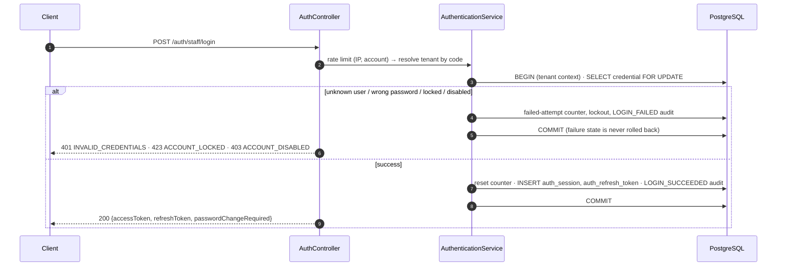

# Authentication & Sessions

Implemented in `backend/banking-core/src/main/java/com/company/banking/iam`. Tested in `StaffAuthenticationIT`, `PlatformOnboardingIT` and `AccessTokenServiceTest`.

## Identities

| Store | Table | Login endpoint | Token `aud` | Tenant |
|---|---|---|---|---|
| Institution staff | `staff` + `staff_credential` | `POST /api/v1/auth/staff/login` `{tenantCode, username, password}` | `staff` | from the institution code |
| Platform administrators | `platform_user` | `POST /api/v1/platform/auth/login` `{username, password}` | `platform` | none (platform context) |
| Customers (Phase 6) | `customer_credential` | customer channel | `customer` | from the white-label app |

Each audience can only reach its own API area: `/api/v1/platform/**` requires `aud=platform`, and every other `/api/v1/**` path requires `aud=staff`.

## Tokens

**Access token**: RS256 JWT, 10 minutes, signed with the key from `banking.security.jwt.private-key`.

| Claim | Meaning |
|---|---|
| `sub` | staff / platform user id |
| `aud` | `staff` or `platform` |
| `tid` | tenant id (staff only); the **only** source of tenant identity for a request |
| `sid` | session id, checked against `auth_session` on every request |
| `perms` | permission codes (empty while a temporary password is in use) |
| `brs` | branch scope: `"*"` or a list of branch ids |
| `pcr` | password change required |
| `uname`, `iss`, `iat`, `nbf`, `exp`, `jti` | standard |

**Refresh token**: opaque, `s.<tenantId>.<256-bit secret>` or `p.<secret>`, stored only as a SHA-256 hash. Single use. Valid for the idle timeout (staff 30 min, platform 15 min) and never beyond the session's absolute lifetime (staff 12 h, platform 4 h).

## Flows

| Flow | Behaviour |
|---|---|
| **Unknown institution, unknown user, wrong password** | All return `401 INVALID_CREDENTIALS`; a dummy Argon2 check equalises timing. |
| **Lockout** | 5 consecutive failures (configurable) lock the login for 30 minutes (`423 ACCOUNT_LOCKED`). An administrator with `staff.unlock` can reset it at once, which issues a new temporary password. |
| **Temporary password** | New staff and resets get a 16-character random password, shown once. Until changed, the token carries no permissions and protected endpoints return `403 PASSWORD_CHANGE_REQUIRED`. |
| **Refresh** | Rotates the token. Presenting an already-rotated token is treated as theft: the session is revoked and `REFRESH_TOKEN_REUSE_DETECTED` is audited. **Clients must refresh one request at a time.** The CMS BFF and the Flutter Dio interceptor implement single-flight refresh. |
| **Logout** | Revokes the session. The access token stops working immediately (per-request session check). |
| **Password change** | Requires the current password (failures count towards lockout), enforces the policy, revokes **all** sessions of the user and returns fresh tokens. |
| **Revocation triggers** | Role assignment changes, branch-scope changes, suspension/termination, credential reset, and institution suspension all revoke sessions at once. Editing a role's permissions takes effect at the next token refresh (≤ 10 min). |

## Password policy (NIST SP 800-63B style)

- 12–128 characters, at least 6 distinct characters.
- Not a common password and not containing one (blocklist), not containing the username, not equal to the current password.
- No composition rules and no periodic expiry.
- Stored as Argon2id (`{argon2}` prefix via `DelegatingPasswordEncoder`); cost defaults to the OWASP minimum (19 MiB, t=2, p=1). `ProductionSafetyGuard` refuses to start deployed environments with a weaker cost, ephemeral JWT keys or the in-memory rate limiter.

## Rate limiting

Fixed windows per client IP (30/min) and per account (10 per 5 min) on login endpoints, stored in Redis. If Redis is unavailable the limiter **fails open** and logs a warning; the database-backed lockout still protects every account.

## Multi-factor authentication (TOTP)

| Step | Endpoint | Behaviour |
|---|---|---|
| Enrol | `POST /api/v1/auth/mfa/totp/setup` | Returns a 160-bit secret (Base32) and an `otpauth://` URI for a QR code. The secret is stored encrypted and is inactive until confirmed. |
| Confirm | `POST /api/v1/auth/mfa/totp/activate {code}` | Enables MFA, ends every other session, returns fresh tokens. |
| Sign in | `POST /auth/staff/login` (or platform login) | With MFA enabled, a correct password returns `mfaRequired=true` and a 5-minute `mfaChallengeToken` instead of tokens. |
| Second factor | `POST /api/v1/auth/mfa/verify {challengeToken, code}` | Issues tokens. Wrong codes count towards the account lockout. |

- RFC 6238: HMAC-SHA1, 30-second steps, 6 digits, ±1 step clock drift. **A code is accepted only for a step after the last accepted one**, so an intercepted code cannot be replayed.
- The challenge token is a signed JWT with audience `mfa`. The access-token decoder rejects that audience, so a challenge can never be used to call the API.
- An administrator credential reset (`staff.unlock`) also removes the enrolment (lost phone); the user enrols again after changing the temporary password.
- **Platform administrators** must enrol: with `banking.security.mfa.platform-required=true` (enforced in deployed environments) a platform login without MFA yields a token with no permissions and `mfaEnrollmentRequired=true`; protected endpoints answer `403 MFA_ENROLLMENT_REQUIRED` until enrolment is completed.

## Planned

- Institution policy to require MFA for all staff or for sensitive roles.
- Recovery codes.
- Breached-password check (k-anonymity range API or an offline list).
- JWKS endpoint and key rotation (multiple `kid`s).
- Customer channel: device binding, transaction PIN (Argon2id over HMAC-peppered PIN), OTP, device-key step-up.
